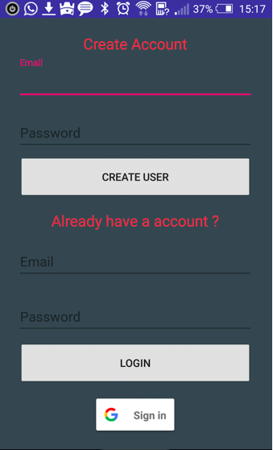
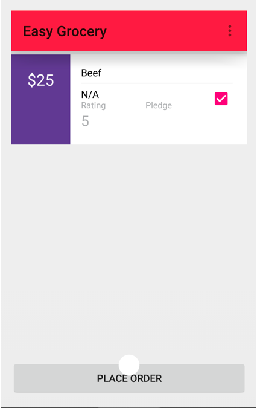

# Easy Grocery

The Android application helps users to buy grocery online and get them delivered.

## Getting Started

The following software/products are needed in order to run this application on your machine.

### Prerequisites

1. Android Studio/Eclipse
2. Oracle Virtual Box
2. Genymotion
3. latest jdk
4. Google Play services for genymotion Emulator

### Installing

1. Start by installling latest version of jdk on your machine.
2. Download Android studio and install it. Or you can use Eclipse for Android development by installing required ADT plugin.
3. Visit www.genymotion.com, register, download and install Genymotion. Also downlaod Oracle VirtualBox along with Genymotion.
4. After installing the genymotion, open it and setup an Android devie emulator. Genymotion has Android verion from 
   2.3.7 API 10 GingerBread to 7.1.0 API 25 Nougat.
5. Launch the genymotion and set up google play services on the emulator by following the link below:
   https://stackoverflow.com/questions/20121883/how-to-install-google-play-services-in-a-genymotion-vm-with-no-drag-and-drop-su
6. Download this project and open it with Android Studio.

## Deployment

1. Build the project by either clicking play symbol in the toolbar. Or click on Build -> Generate Signed Apk.
   [Note in case Android studio throws error asking for updating repositories, update the repositories for normal 
   functioning of the project].
2. apk file can be found in the folder - ProjectName\app\build\outputs\apk.
3. copy the apk on Android device by either usb cable or bluetooth transfer.
4. Install application on Android device and open it.

## Built With

1. The application is tested on Android versions 4.4.4 API 19 Kitkat, 5.0.0 API 21 Lollipop.

## Screenshot
### 1. Login Screen:

   
   
   
### 2. Navigation Drawer:
   Fetched user profile.

   
   

### 3. Store selection:
   User can either see the Store items or select directions to get route between user's location and store location.
   
   
   
   
### 4. CheckOut Screen:
   The checkout screen has advanced animation where user can click on item and it expands to show user more detail about the 
   item. The first screenshot is the checout screen, while the second screenshot shows detailed verion of the item after the 
   user clicks on the item.
   
   
   
   
   
### 5. About Us:
   The about us page also has advanced animation where the ViewPager expands to show detailed information.
   
   
   
   

## Acknowledgments

* Used libraries created by florent37 for expanding ViewPager function of the application.
* Used libraries created by Aphid Mobile for collapsing and expanding cards.

